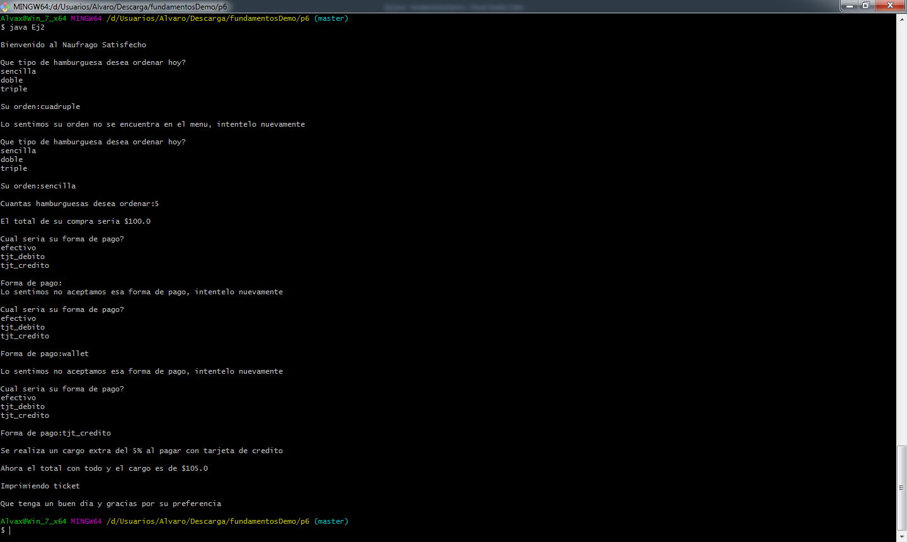
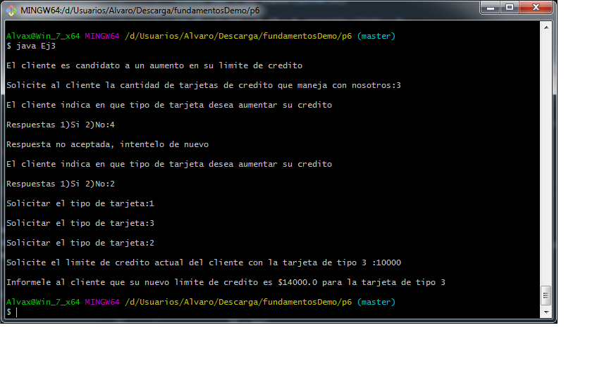

#                    Reporte Practica 6

##                      Ej1 

Este programa calcula el area de un terreno con forma irregular, asi como su valor.
**Entradas:** Medida A, Medida B, Medida C y precio por m2.
**Salidas:** Area total del terreno y valor total del terreno.

##                      Ej2

Este programa toma tu orden de un restaurante de hamburguesas, calcula el costo de tu pedido y de acuerdo con la politica del mismo, si el metodo de pago ingresado es tarjeta de credito, se hace un cargo del 5% sobre el valor de la compra (previo aviso al cliente de dicho cargo)y recibe tu pago e imprime el ticket correspondiente.
**Entradas:** tipo de hamburguesa, cantidad de hamburguesas, forma de pago.
**Salidas** total de costo del pedido sin cargo extra; en caso de recibir pago con tarjeta de credito, total de costo del pedido con cargo extra.

##                       Ej3

Este programa calcula el aumento del limite de credito al que se hace acreedor el cliente que cuenta con una tarjeta de credito, en base al tipo de tarjeta con el que cuenta.
**Entradas:** cantidad de tarjetas que tiene el cliente con el banco, preferencia del cliente por el tipo de tarjeta al que desea aumentar el limite de credito (en caso de que el mismo asi lo indique), tipos de tarjeta con las que cuenta (en caso de que aplique), limite actual de credito con dicho tipo de tarjeta.
**Salidas:** tipo de tarjeta a la le favorecera el aumento dellimite de credito (en caso de que aplique), nuevo limite de credito autorizado por el banco.

##                       Ej4

##                       Ej5

##                       Ej6 - Calculadora