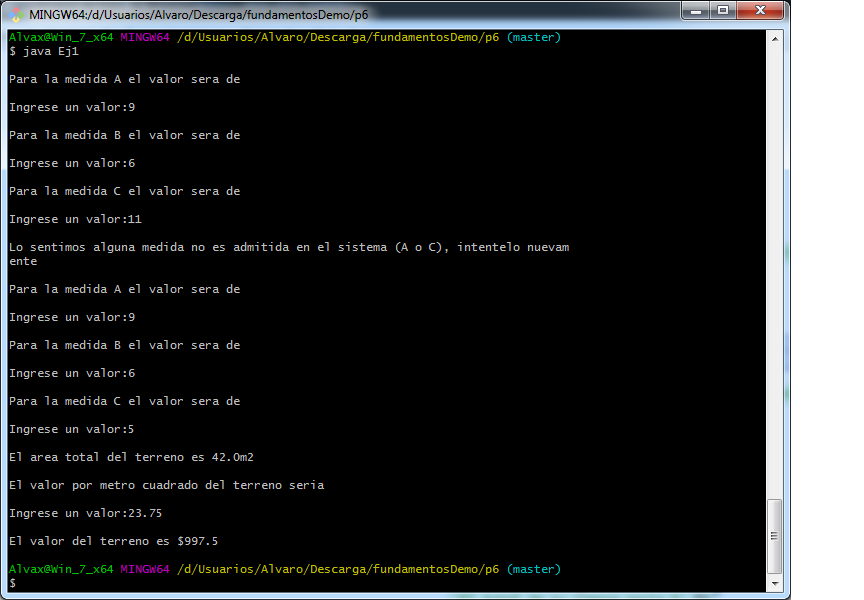

#                    Reporte Practica 6

##                      Ej1 

Este programa calcula el area de un terreno con forma irregular, asi como su valor
**Entradas:** Medida A, Medida B, Medida C y precio por m2
**Salidas:** Area total del terreno y valor total del terreno

##                      Ej2

##                       Ej3

##                       Ej4

##                       Ej5

##                       Ej6 - Calculadora