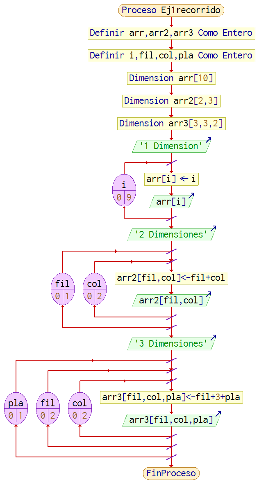
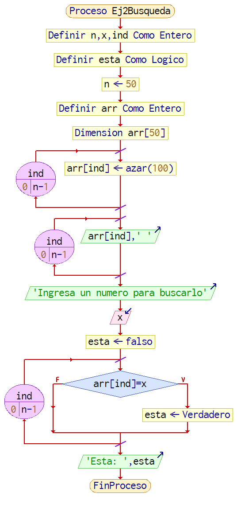
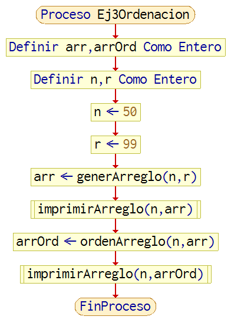
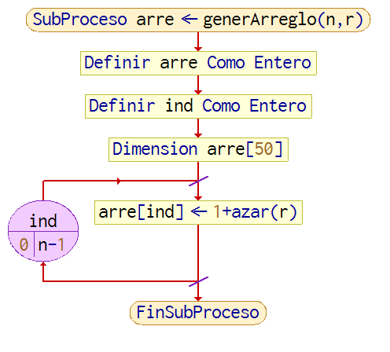
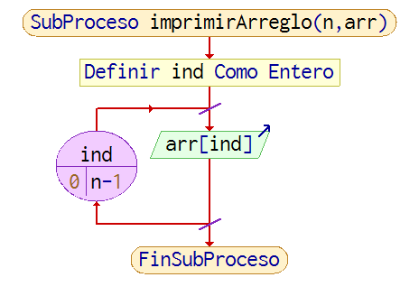
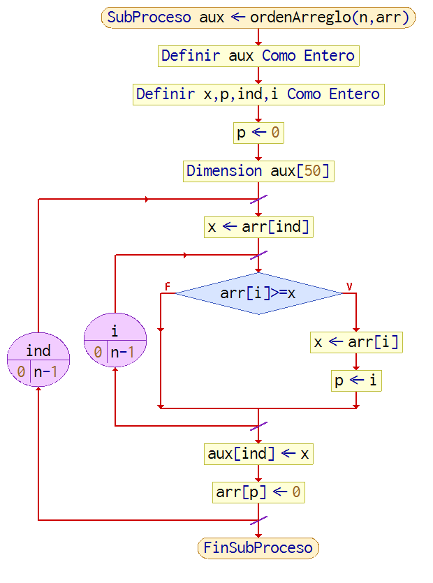
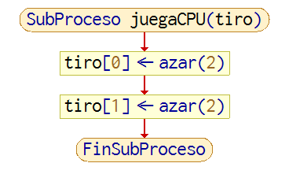
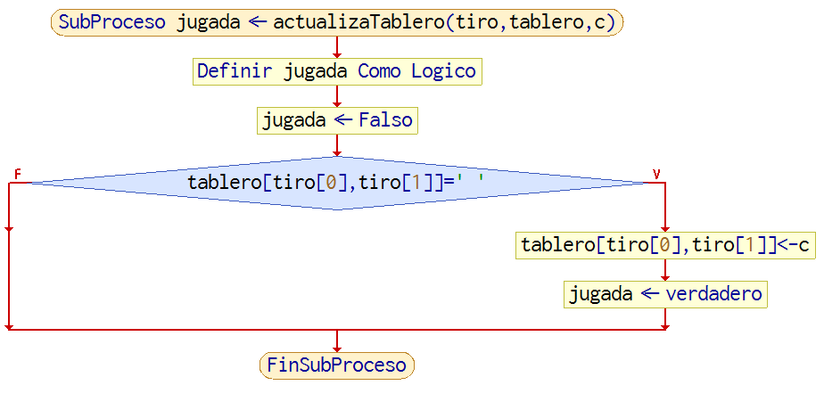
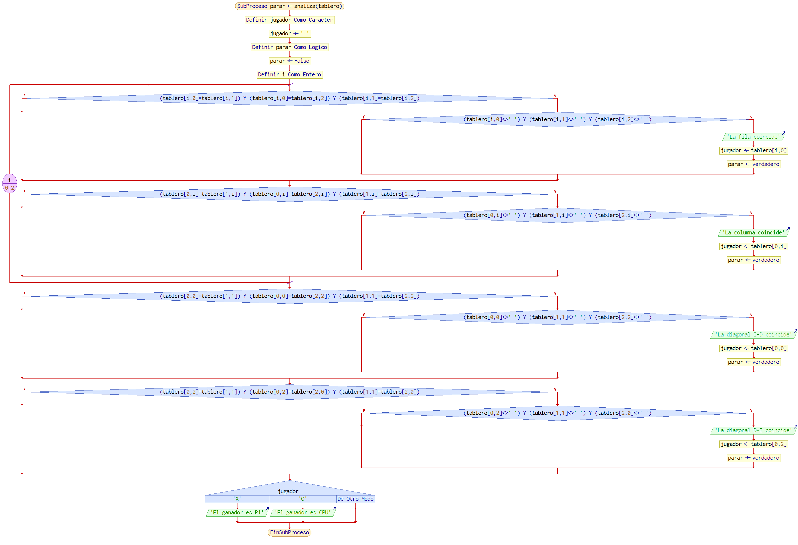
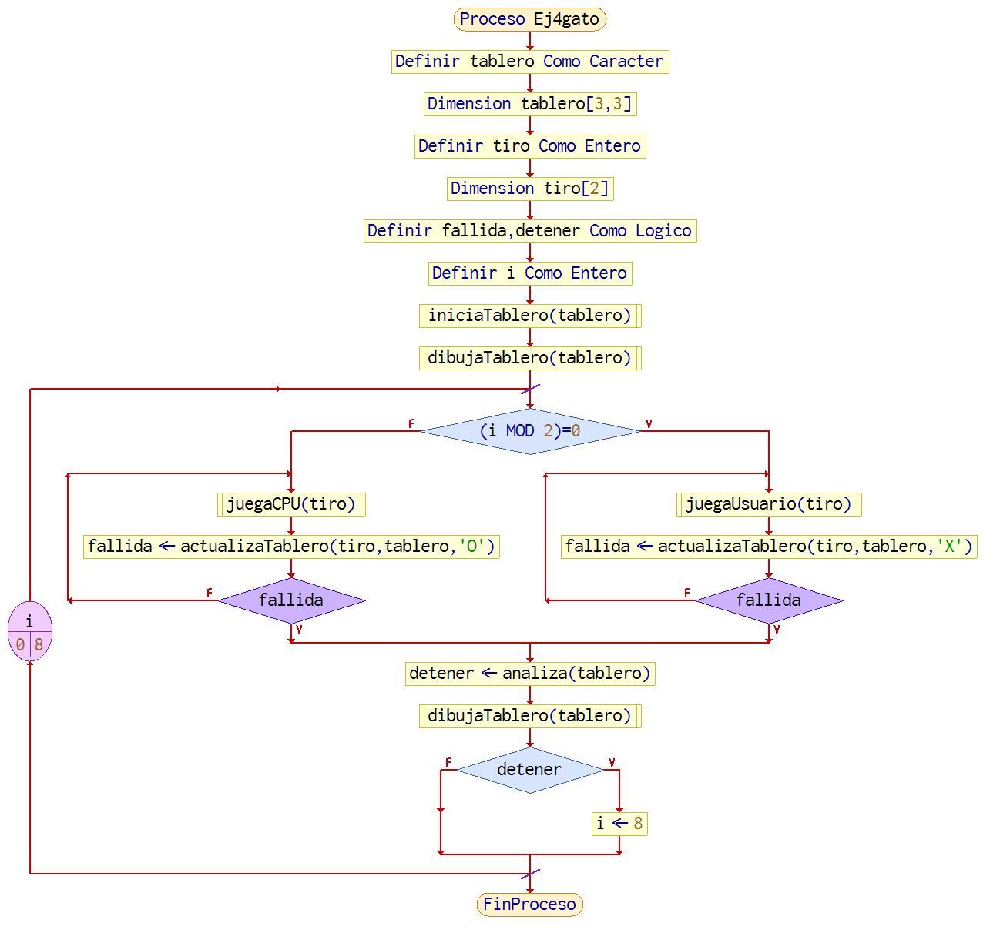

#                    Reporte Practica 7

##                      Resumen 

La practica de esta vez consistio en ver lo referente a los **arreglos** en _Java_, asi como implementar diferentes operaciones y usos de los arreglos, desde solo recorrerlos hasta un juego de gato, junto con esta practica tambien se dio un repaso a la programacion **MODULAR**.

##                      Desarrollo

La practica consistia de 4 ejercicios, 2 vistos durante la clase y 2 mas que solo se iniciaron durante la clase y terminarlos era tema individual:

1. **Recorrido:** el ejercicio constaba de la declaracion de 3 tres arreglos, de 1, 2 y 3 dimesiones respectivamente, su llenado e impresion, mas que nada entendiendo como recorrerlos.

* El algoritmo usado para este ejercicio es el siguiente:

2. **Busqueda:** para este ejercicio debiamos de generar un arreglo unidimensional, rellenarlo usando la funcion **Math.random** de _Java_ y posteriormente imprimirlo, luego solicitar al usuario un numero y buscar si es que el numero ingresado existia o no dentro del arreglo y mostrar en pantalla dicha conclusion.

* El algoritmo implementao en este ejercicio es el siguiente:

**NOTA 2:** aqui la logica del **buscador** varia ligeramente comparado con _Java_.

3. **Ordenacion:** este ejercicio consistia en generar un arreglo unidimensional, mostrarlo en pantalla, moverlo de forma **ordenada** _de mayor a menor_ hacia otro arreglo y finalmente mostrar el nuevo arreglo ordenado en pantalla, esto usando diversos _modulos_, cada uno encargado de funciones especificas.

* El modulo _principal (main)_ es:

* El modulo _generArreglo_:

* El modulo _imprimirArreglo_:

* El modulo _ordenArreglo_:

**NOTA 3:** el **pseudocodigo** en _PSeInt_ no se logra ejecutar de manera correcta como en _Java_, por lo que los diagramas son unicamente para mostrar los algortimos correspondientes.

4. **gato:** como el nombre lo indica se trata basicamente del juego del _"gato"_, como se le conoce normalmente, el profesor ya habia construido previamente un codigo, pero era nuestro trabajo el completarlo para que se pudiera jugar de forma normal, donde los temas a resolver o completar eran los siguientes:

* Modulo _void juegaCPU_, donde la jugada del CPU debia ser generada aleatoriamente, la solucion implementada es la siguiente:

* Modulo _boolean actualizaTablero_, el cual debia validar cada jugada, tanto del usuario como del CPU para evitar que se jugara en casillas que ya se encontraran ocupadas previamente, el algoritmo modificado queda de la siguiente manera:

* Modulo _boolean analiza_, modulo encargado de revisar el tablero despues de cada jugada y determinar al ganador, en caso de haber alguno, asi como tambien indicar cuando se debe detener el juego si hay algun ganador, la logica implementada para este modulo es la siguiente:

* Modulo _void principal (main)_, ya con los modulos actualizados y completos, quedan de la siguiente manera, junto con los ajustes de este mismo modulo para ir de corrido con todas la judas posibles en el tablero hasta que este completo o hasta que se indique hay un ganador y detenga su ejecucion, el modulo _main_ queda con esta estructura:

**NOTA 2:** aqui la logica del **gato** varia ligeramente comparado con _Java_, el **pseudocodigo** no esta completo aqui, los diagramas solo son para mostrar graficamente el algoritmo usado para los modulos listados en la parte superior.

##                        Resultados

##                        Discusion

##                        Conclusion

