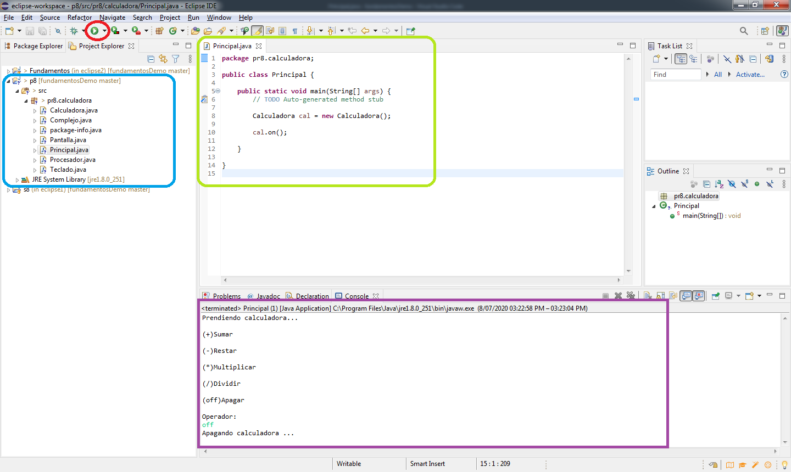

#                    Reporte Practica 8

##                      Resumen 

La practica fue acerca del manejo del software _Eclipse_ y la _programacion modular_, pero en lugar de hacerlo con **Metodos**, este se hizo con **Clases**, aprender a relacionar las **Clases** y **Metodos** diferentes asi como el paso de parametros de uno a otro, junto con el software _Eclipse_ para generar nuestros propios proyectos; esto corresponde a las bases del paradigma de _Programacion Orientada a Objetos_, dnde se vio la _instanciacion_ o _creacion de objetos_ a base de otras **Clases** y la forma de invocacion de sus respectivos **Metodos** e incluso el concepto basico de **Constructores**, para las diferentes clases, todo en torno a una calculadora de _numero complejos_.

##                      Desarrollo

La practica se fue realizando durante la sesion del jueves **02/07/2020** con la guia del profesor y siguiendo el enunciado de la misma:

1. Crear un proyecto con eclipse y una clase llamada Principal

2. Crear las clases: Calculadora, Teclado, Procesador, Pantalla y Complejo, siguiendo las instrucciones y quedando de la siguiente manera:

**Complejo**

* //_Atributos_
* privado doble real;
* privado doble imaginario;

* //_Constructores_
* publico Complejo(){}
* publico Complejo(doble real, doble imaginario){}  //Aqui ya se incluye el _punto 3_ del enunciado de la practica, con un **Constructor** para inicializar los atributos de esta clase

* //_Metodos set y get para el elemento real_
* publico doble getReal(){}
* publico void setReal(doble real){}

* //_Metodos set y get para el elemento imaginario_
* publico doble getImaginario(){}
* publico void setImaginario(doble imaginario){}

**Procesador**

* //_Metodos_
* publico Complejo sumar(Complejo c1, Complejo c2){}
* publico Complejo restar(Complejo c1, Complejo c2){}
* publico Complejo multiplicar(Complejo c1, Complejo c2){}
* publico Complejo dividir(Complejo c1, Complejo c2){}

**Pantalla**

* //_Metodos_
* publico void imprimirComplejo(Complejo c){}

**Teclado**

* //_Atributos_
* Scanner leer(System.in);

* //_Metodos_
* publico String capturaOper(){}
* publico String capturaNumero(){}

**Calculadora**

* //_Atributos_
* Pantalla p;
* Teclado t;
* Procesador proc;

* //_Constructores_
* publico Calculadora(){}

* //_Metodos_
* publico void on(){}

Como punto importante cabe mencionar que las _clases_ pueden ser tomadas tambien como nuevos tipos de datos compuestos y estos pueden ser declarados y usados entre diferentes _clases_ que se encuentren dentro del mismo _proyecto_ y esta sean publicas; como recordatorio el **declarar como variables** a una _clase_ se le llama instanciar, esto quiere decir crear **objetos** que son del tipo de la _clase_ y estos pueden ser usados como _variables_, asi como usar tambien sus **metodos y atributos**.

##                        Resultados

Aqui se muestra una imagen donde se ve la interfaz que maneja _Eclipse_ y se resaltan algunos elementos importantes y son:

* **Rojo:** el boton que compila y relaciona de forma automatica todas las clases que utliza el proyecto, asi como ejecutarlo completo.

* **Azul:** area donde se listan todas clases y paquetes que ocupa el proyecto, estan organizadas y se pueden añadir directamente desde esa seccion con click derecho e indicando que tipo de elemento se desea añadir y donde.

* **Verde:** seccion donde se muestran en forma de pestañas todas las clases sobre las que se esta trabajando y debajo de cada pestaña su respectivo codigo, tambien esa seccion sirve como editor de codigo.

* **Morado:** seccion que tras ejecutar el codigo es donde se muestran las salidas en pantalla y se solicitan y leen los datos que ingresa el usuario; en la parte superior te indica si es que ya termino de ejecutarse el codigo, asi como otros detalles como es la fecha y hora de compilacion y ejecucion.

##                        Discusion

##                        Conclusion

